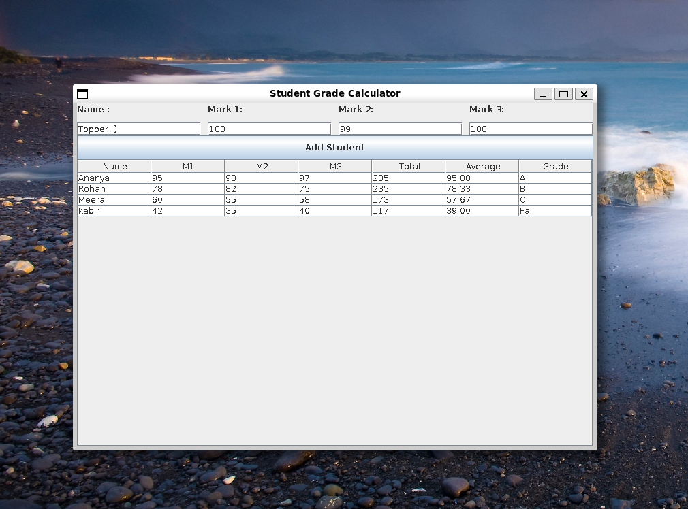

# 🎓 Grade Calculator GUI – Java Swing Project

A sleek and user-friendly **Java Swing GUI** app that calculates a student’s total marks, average, and final grade (A/B/C/Fail) based on three subject scores.



---

## 🚀 Features

- 📥 Input: Name + 3 Subject Marks
- 🔢 Auto calculation: Total, Average, and Grade
- 📊 Dynamic Table: View all students at a glance
- ✅ Grade Scale:
  - A: 90 and above
  - B: 75–89
  - C: 50–74
  - Fail: Below 50

---

## 🛠️ Built With

- Java `Swing`
- Java `JTable`, `JPanel`, `JLabel`, `JTextField`, and event listeners

---

## 💻 How to Run

1. Compile the file:
   ```bash
   javac GradeCalculatorGUI.java
